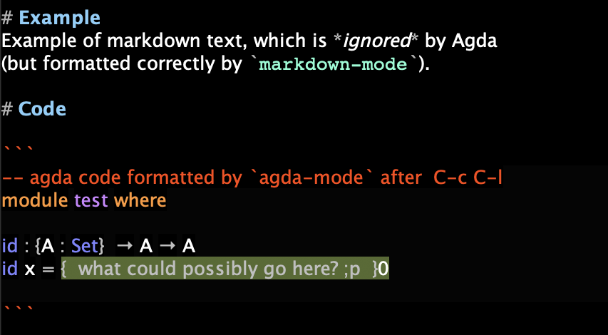

# markdown-agda-mode
An Emacs mode for literate Markdown Agda programming.
Adapted directly from a corresponding literate [org Agda mode](https://github.com/alhassy/org-agda-mode).
This allows to edit `.lagda.md` files in Emacs and have both Markdown and Agda highlighting *at the same time*.
In order to load the Agda part, it is necessary to put the cursor within an Agda block of code and hit `C-c C-l`.

